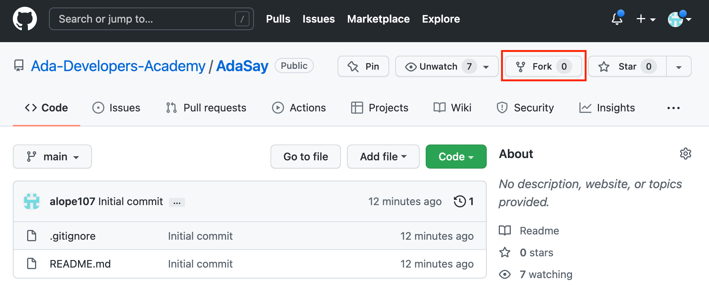
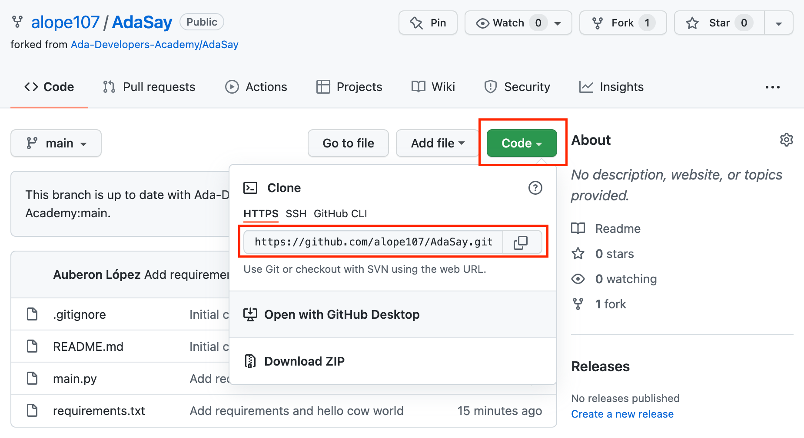

# AdaSay

This repository gives us a chance to practice using git and virtual environments. We will take a small program and practice how we can manage its dependencies using a virtual environment. We'll also practice forking and cloning a repository, as well as making a commit and pushing changes.

## Forking and Cloning the Repository

1. To start, we want make our own copy of the GitHub repository to work with. We do this by _forking_ the repository. Click the **Fork** button on GitHub. This new repository copy will be owned by your GitHub account.



2. Next, we want to copy the code from GitHub down to our computer. We will do this by cloning the code. Click the green **Code** Button, then copy the URL from the dropdown that appears.



3. Open a terminal on yor computer, and navigate to the directory where you wish to copy this exercise's code to. Once you are in the desired directory, run this command, using the URL you copied in the previous step: 

```git clone YOUR_REPO_URL```

4. After the repository is copied, move into the repository directory.

```cd AdaSay```

## Create a Virtual Environment and Install Dependencies

5. The AdaSay project requires the cowsay package to run. We want to install this dependency in a virtual environment so that it is used only for this project. We first run the following command to create a virtaul environment:

```python -m venv venv```

6. This will create a new folder named `venv` which will hold all the information about our virtual environment. Verify that this folder was created by running `ls` and seeing that `venv` is one of the folders present.

7. We now need to activate the virtual environment. Everything else up to this point was one-time setup, but we will need to repeat this step each time we open a new terminal to interact with this project. We activate the virtual environment by running the activation script in the `venv` folder.

```source venv/bin/activate```

8. Verify that the virtual environment has been activated. If `(venv)` appears at the front of your shell prompt, you have successfully activated the environment.

9. Next, we want to install all the requirements. This projects specifies the what packages it needs in the `requirements.txt` file. We use pip to read this file and install the needed dependencies:

```pip install -r requirements.txt```

10. Now that the requirements are installed, we're ready to try running our program. Run the following command (in a terminal that has the virtual environment activated) and see if we get a cow outputted:

```python main.py```

## Make and Commit Changes

11. Right now the cow doesn't say anything interesting. Let's change that! Start by opening VS Code in the AdaSay directory.

```code .```

12. Edit `main.py` to make the cow say something interesting. Make sure to save the file in VS Code after you make your change!

13. Verify that your changes work by running `main.py` again. (Note: if you use the terminal inside VS Code, you may need to activate the virtual environment on that new terminal. See step 7.)

```python main.py```

14. Once you're satisfied with your changes double-check which files have been changed.

```git status```

15. You should expect to see that only `main.py` was changed. We'll now stage this for our commit.

```git add main.py```

16. Check the status of the files again. You should see that `main.py` is now shown in green, indicating that it will be part of our commit.

```git status```

17. Commit the changes. Add some meaningful commit message that describes the changes you made. (Hint: do not use exclamation marks in your commit message)

```git commit -m "Changed cow message to COWABUNGA"```

18. Push the changes to GitHub. If asked for a username and password, use your GitHub username and your Personal Access Token (PAT).

```git push origin```

19. Check that the changes are reflected in GitHub. Refresh the GitHub page in your browser and see that your new change is present in `main.py`.

20. BONUS: do some searching online to figure out how to have cowsay use a dragon instead of a cow. Modify your code to use the dragon, stage your changes, make a commit, and push the commit to GitHub.

21. Once you're finished working on this exercise, deactivate the virtual environment.

```deactivate```